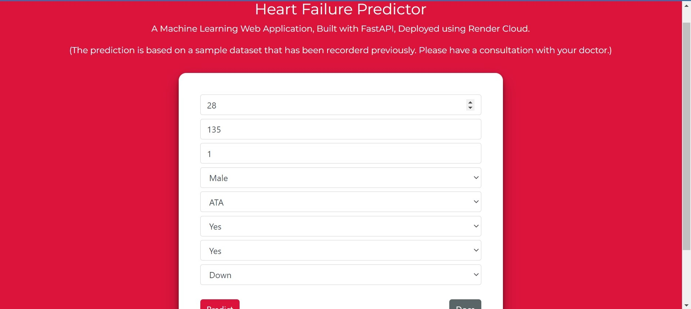

# Heart Failure Predictor 


Heart Disease Predictor app is a web application used to tell whether the person has heart disease or not based on certain input parameters. It was created using python's scikit-learn, fastapi, numpy and joblib packages.

## Context
Cardiovascular diseases (CVDs) are the number 1 cause of death globally, taking an estimated 17.9 million lives each year, which accounts for 31% of all deaths worldwide. Four out of 5CVD deaths are due to heart attacks and strokes, and one-third of these deaths occur prematurely in people under 70 years of age. Heart failure is a common event caused by CVDs and this dataset contains 11 features that can be used to predict a possible heart disease.

People with cardiovascular disease or who are at high cardiovascular risk (due to the presence of one or more risk factors such as hypertension, diabetes, hyperlipidaemia or already established disease) need early detection and management wherein a machine learning model can be of great help.

## Dataset Description
The data contains the following columns:

| Feature Name   | Feature Description                                                               |
| -------------- | --------------------------------------------------------------------------------- |
| Age            | age of the patient [years]                                                        |
| Sex            | sex of the patient [M: Male, F: Female]                                           |
| ChestPainType  | chest pain type [Typical Angina, Atypical Angina, Non-Anginal Pain, Asymptomatic] |
| RestingBP      | resting blood pressure [mm Hg]                                                    |
| Cholesterol    | serum cholesterol [mm/dl]                                                         |
| FastingBS      | fasting blood sugar [1: if FastingBS > 120 mg/dl, 0: otherwise]                   |
| RestingECG     | resting electrocardiogram results                                                 |
| MaxHR          | maximum heart rate achieved [Numeric value between 60 and 202]                    |
| ExerciseAngina | exercise-induced angina [Y: Yes, N: No]                                           |
| Oldpeak        | oldpeak = ST [Numeric value measured in depression]                               |
| ST_Slope       | the slope of the peak exercise ST segment [Up, Flat, Down]                        |
| HeartDisease   | output class [1: heart disease, 0: Normal]                                        |

## Installation
Clone the repository using `git`
```
git clone <git url>
```
Change to the cloned directory
```
cd <directory_name>
```
To install all requirement packages for the app
```
pip install -r requirements.txt
```
Then, Run the app
```
python -m uvicorn main:app
```

## 📷 Screenshots
### Home page
### Predictor

### Redoc UI

### Demo 

